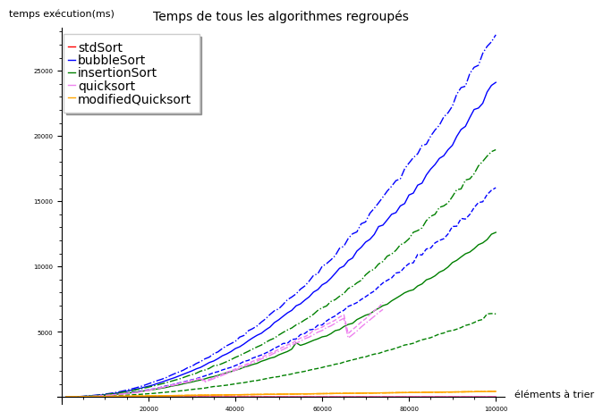
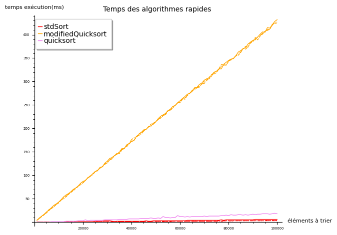

# 🚀 Algorithmes de Tri - Analyse comparative

Ce projet vise à comparer les performances de différents algorithmes de tri en C++. L'objectif est d'analyser leur efficacité en fonction de la taille et de la structure des données à trier.

## 📋 Table des matières

- [Présentation des algorithmes](#présentation-des-algorithmes)
- [Structure du projet](#structure-du-projet)
- [Résultats de l'analyse](#résultats-de-lanalyse)
- [Paramètres de compilation](#paramètres-de-compilation)
- [Comment lancer le projet](#comment-lancer-le-projet)

## 🧮 Présentation des algorithmes

### std::stable_sort
Fonction de la bibliothèque standard C++ disponible dans l'en-tête `<algorithm>`. Cet algorithme utilise une méthode de tri fusion qui applique le principe "diviser pour régner". Il divise récursivement le tableau en sous-tableaux jusqu'à obtenir des tableaux unitaires, puis les fusionne en veillant à ce qu'ils soient triés.

### Tri à bulles
Ce tri repose sur la comparaison des éléments adjacents par paires. L'algorithme parcourt le tableau en comparant chaque élément avec son voisin, en les échangeant si nécessaire. Il continue jusqu'à ce qu'un parcours complet soit effectué sans aucun échange.

### Tri par insertion
Cet algorithme prend les éléments un par un et les place à leur position correcte parmi les éléments déjà triés. Il commence avec le premier élément et considère que cette portion est déjà triée. Pour chaque nouvel élément, il le compare aux éléments triés et l'insère à sa place.

### Tri rapide (Quicksort)
Dans cette méthode, on sélectionne un pivot (dans notre implémentation, le premier élément du tableau) et on réorganise le tableau pour que tous les éléments inférieurs au pivot soient à sa gauche et tous les éléments supérieurs à sa droite. On applique ensuite récursivement ce processus aux sous-tableaux gauche et droit jusqu'à ce que tout le tableau soit trié.

### Tri rapide modifié
Variante du tri rapide où le pivot est choisi aléatoirement parmi les éléments du tableau à trier, au lieu de prendre systématiquement le premier élément.

## 🗂️ Structure du projet

```
algorithmes-tri/
├── algo/
│   ├── bubbleSort.cpp
│   ├── insertionSort.cpp
│   ├── modifQuicksort.cpp
│   ├── quicksort.cpp
│   └── stdSort.cpp
├── data/
│   └── [fichiers de données]
├── plots/
│   ├── individual/
│   │   └── [graphiques individuels]
│   ├── all_plots.png
│   ├── fast_running_time.png
│   └── slow_running_time.png
├── build.sh
├── main.cpp
├── sort.hpp
└── README.md
```

## 📊 Résultats de l'analyse

### Comparaison globale des algorithmes



On constate sur ce graphique qui comprend les temps d'exécution de tous les algorithmes (en millisecondes) que certains sont beaucoup plus rapides que d'autres pour trier la liste. L'écart est tellement important que les temps les plus rapides sont illisibles sur cette échelle.

### Algorithmes à temps d'exécution lents


Les algorithmes avec des temps d'exécution lents sont le tri à bulles et le tri par insertion:
- **Tri à bulles**: Temps d'exécution entre 15000 et 28000 millisecondes pour 100000 éléments
- **Tri par insertion**: Temps d'exécution entre 5000 et 18000 millisecondes pour 100000 éléments

### Algorithmes à temps d'exécution rapides



Les algorithmes avec des temps d'exécution rapides sont:
- **std::stable_sort**: Temps d'exécution inférieurs à 10 millisecondes pour 100000 éléments
- **Tri rapide modifié** (pivot aléatoire): Temps d'exécution autour de 430 millisecondes pour 100000 éléments

### Le cas particulier du tri rapide

Le tri rapide basique présente un comportement intéressant:
- Avec une liste **entièrement aléatoire**: Temps d'exécution rapide (environ 15 millisecondes pour 100000 éléments)
- Avec une liste **partiellement triée**: Temps d'exécution très lent (environ 7000 millisecondes pour 75000 éléments), voire impossible à terminer au-delà

## ⚙️ Paramètres de compilation

Lors de la compilation, deux paramètres spécifiques sont utilisés:

- **-Wall**: Abréviation de "warn all", permet au compilateur d'afficher le maximum d'avertissements potentiels lors de la compilation.
- **-Ofast**: Active toutes les optimisations les plus agressives pour que le programme s'exécute le plus rapidement possible.

> ⚠️ Attention: L'optimisation très agressive activée par `-Ofast` peut parfois outrepasser certaines normes et conduire au dysfonctionnement d'un programme pourtant bien écrit.

## 🚦 Comment lancer le projet

1. Clonez le dépôt:
```bash 
git clone https://github.com/RobinHil/algo-tri
cd algo-tri
```

2. Lancez le script de compilation et d'exécution:
```bash
chmod +x build.sh
./build.sh
```

3. Consultez les résultats dans le dossier `plots/`.
